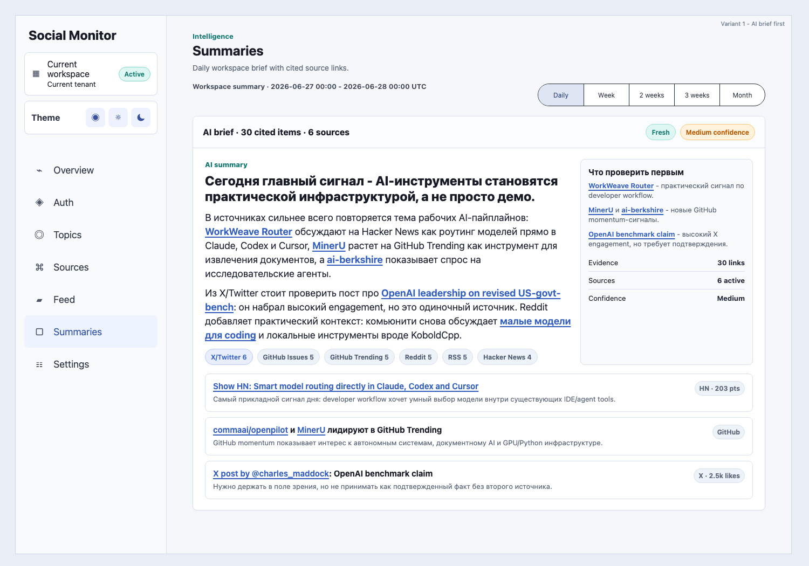

# Reader Summary AI Brief V1

Chosen summary reader layout:

UX invariants:

- AI-generated brief is the first content inside the summary card.
- Inline source links are visible and clickable from the brief and top-read cards.
- Summary text is selectable like normal web text.
- Provider chips filter the evidence list below the brief.
- Technical evidence and quality diagnostics stay available, but below the brief.
